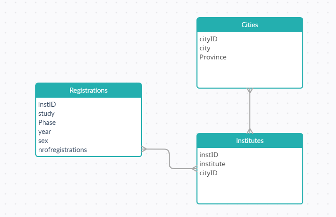

# Assignment 1

**1.1 Which attributes are the facts; which attributes are the dimensions?**

The following attributes are facts:
- number of events
- total participants

The following attributes are dimensions:
- day of the week
- year
- location

**1.1 Draw a conceptual star schema for this cube.**

**1.2 Which attributes are the facts; which attributes are the dimensions?**

The following attributes are facts:
- sex
- nrofregistrations

The following attributes are dimensions:
- instID
- institute
- cityID
- city
- province
- study
- phase
- year

**1.2 Draw a conceptual star schema for this cube.**

